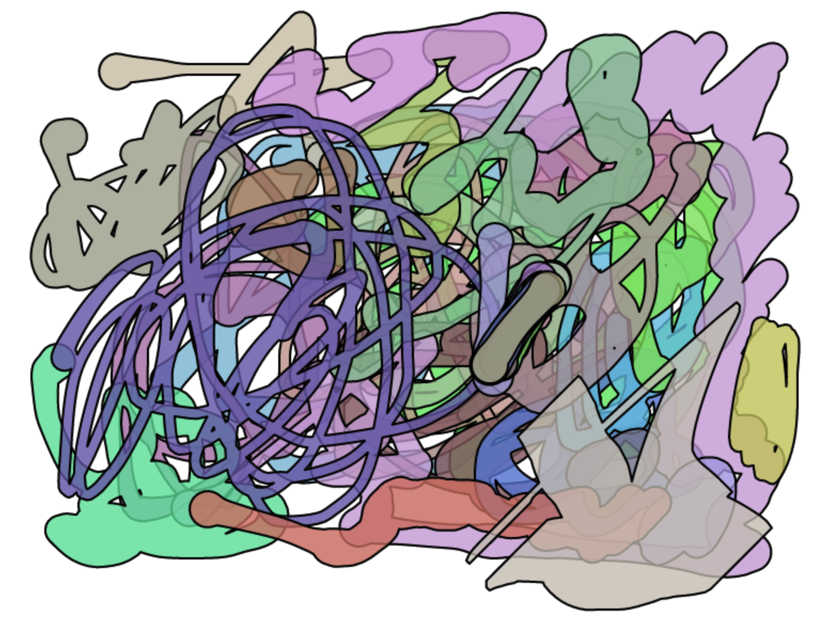
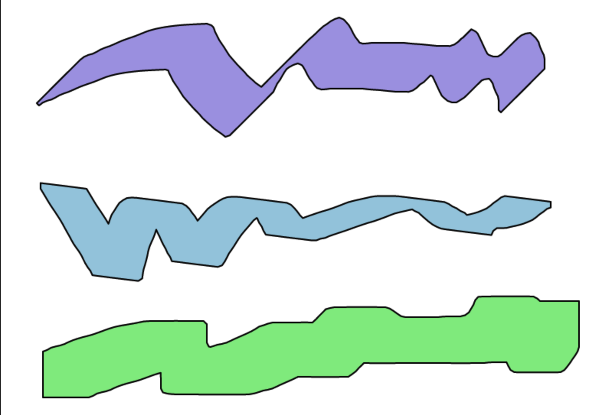
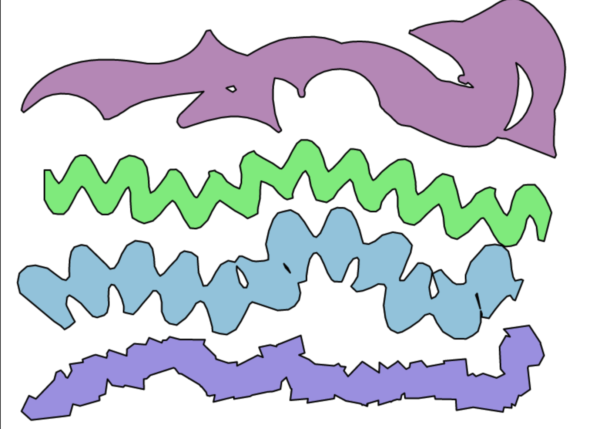

# squiggy

### [Demo](https://squiggy.netlify.app) | [Download](dist/squiggy.js)



Squiggy is a lightweight vector brushstroke library. It has a set of configurable components that helps you build very customizable brushes. It is small (~17KB) and does not have dependencies.

You can try the live demo [here](https://squiggy.netlify.app).

## Quick Start

Include the library:

```html
<script src="squiggy.js"></script>
```

or Node.js:

```js
const squiggy = require('squiggy');
```

First define a brush:

```js
let my_brush = squiggy.tube_brush(o=>({w:10}));
```

Pass a polyline to the returned `my_brush` function, to turn it into a set of polygons that forms brushstroke:

```js
let polygons = my_brush(
  [[107,49],[107,51],[105,54],[102,59],[99,63],[95,70],[90,80]],
  {
    preprocess:[
      {type:'catmul-rom'},
      {type:'resample',step:6}
    ],
    clean:true,
  }
);
```

The input polyline can be 2D, 3D (optional pressure) or 4D (optional velocity). See following sections for more details. 

The first output polygon is the outline, and the rest are holes. We can draw them, using say, SVG:

```js
let o = `<svg xmlns="http://www.w3.org/2000/svg" width="200" height="200">
         <path fill-opacity="0.2" stroke="black" d="`;
polygons.forEach(polygon=>{
  o += 'M';
  polygon.forEach(xy=>{ o += `${xy[0]} ${xy[1]} `;})
  o += 'z ';
})
o += `" /></svg>`;
document.write(o);
```

## Brush Base Types

There're three brush base types in squiggy, `tube_brush` (which we just saw), `stamp_brush` and `custom_brush`. They're suitable for different purposes, and we can build a wide range of custom brushes starting from one of these bases.

- Tube brush is the trace of a circle that changes radii as it moves along a path.
- Stamp brush is the trace of a convex shape of fixed scale and rotation that moves along a path.
- Custom brush is the trace of a set of arbitrary and differing convex shapes that morphs between each other placed along a path.

Tube brush perhaps best befits most common notion of a "paintbrush"; Stamp brush is best for simulating markers or gothic caligraphy, and has the fastest algorithm; Custom brush is the most powerful (and customizable), but it's also the slowest to compute.

### Tube Brush


The first argument to `tube_brush` is a function. The function is evaluated for each point in the polyline. The function takes a single object as argument, in which the library passes information about point. The output of the function is also an object, informing the library in turn on how to draw the point. The keys of objects are listed and explained below:

```js
let brush = squiggy.tube_brush(
  o=>{
    let {
      i,  // index of this point in polyline
      d,  // distance travelled from start of path to this point
      t,  // percentage of distance travelled (0.0-1.0)
      dx, // delta X from previous point
      dy, // delta Y from previous point
      r,  // local rotation in radians
      x,  // X (0th coordinate)
      y,  // y (1st coordinate)
      z,  // pressure (2nd coordinate), directly read from the input polyline
      v,  // velocity (3rd coordinate), if not in the input polyline, 
          // then calculated as Math.hypot(dx,dy)
    } = o;

    return {
      w: Math.sin(t*Math.PI)*20 // radius (half stroke width) at point
    }  
  }
);
```

The second argument 

### Stamp Brush



The stamp brush is straightforward: The first argument is the polygon to "stamp" at each point along the polyline, while the second is an object with additional options:

```js
let brush = squiggy.stamp_brush(
  [
    [-1,0.9],[0.9,-1],[1,-0.9],[-0.9,1]  // polygon: convex and clockwise
  ],
  {
    scale:30 // (optionally) scale the polygon
  }
);
```

### Custom Brush



Similar to the tube brush, the first argument to `custom_brush` is a function. The input to the function is the same, but user can specify more outputs.

```js
let brush = squiggy.custom_brush(
  o=>{
    let {
      i,  // index of this point in polyline
      d,  // distance travelled from start of path to this point
      t,  // percentage of distance travelled (0.0-1.0)
      dx, // delta X from previous point
      dy, // delta Y from previous point
      r,  // local rotation in radians
      x,  // X (0th coordinate)
      y,  // y (1st coordinate)
      z,  // pressure (2nd coordinate), directly read from the input polyline
      v,  // velocity (3rd coordinate), if not in the input polyline, 
          // then calculated as Math.hypot(dx,dy)
    } = o;

    return {
      p: [-1,0.9],[0.9,-1],[1,-0.9],[-0.9,1], // shape at the point
      w: 30, // shape X scale
      h: 30, // shape Y scale (optional)
      r: Math.sin(d*0.01)*Math.PI // shape rotation (radians, optional)
    }  
  }
);
```

## Preprocessing

Raw reading from sensor (e.g. mouse or touch screen) might not be optimal polyline input. Squiggy packs several preprocessing passes to help. For examples:

- `'catmull-rom'` makes the path smoother using [catmull-rom splines](https://en.wikipedia.org/wiki/Centripetal_Catmull%E2%80%93Rom_spline).
- `'resample'` resamples the polyline into equidistant points. This is important if the radii/shape of the traced shape changes along the path, otherwise outline will look choppy.
- `'gauss-blur'` applies gaussian blur to specified axis. For example, velocity/pressure across points might need heavy smoothing.
- `'approx'` will simplify the polyline. This might be useful if the input is too noisy. Can also be used as post-processing on output polygon (see next section).

These passes can be either passed as an argument to the brush function (like we saw in Quick Start), or to a separate `squiggy.preprocess` function:

```js
let processed = squiggy.preprocess(
  [[107,49,4],[107,51,5],[105,54,4],[102,59,3],
  [99,63,6],[95,70,7],[90,80,6]],
  [
    {type:'gauss-blur',axis:2,k:6}, // 2k+1 is kernel size
    {type:'catmul-rom',alpha:0.5,resolution:20},
    {type:'resample',step:6}, // step is length of each segment
  ]);
```
 
### Example

Say you have a mouse as input device, so the raw points can be somewhat sparse, and don't contain pressure data. Now we would like to simulate pressure from movement speed, then smoothen and resample the path.

```js
let p = [ // raw polyline
  [107,49],[107,51],[105,54],[102,59],[99,63],[95,70],[90,80]
];

// populate axis 2 with delta distance as "fake" pressure
let q = [];
for (let i = 0; i < p.length; i++){
  if (!i){
    if (i+1 < p.length){
      q.push([...p[i],Math.hypot(p[i+1][0]-p[i][0],p[i+1][1]-p[i][1])]);
    }else{
      q.push([...p[i],1]);
    }
  }else{
    q.push([...p[i],Math.hypot(p[i-1][0]-p[i][0],p[i-1][1]-p[i][1])]);
  }
}

let r = squiggy.preprocess(q,[
  {type:'gauss-blur',axis:2,k:6}, // apply blurring to pressure
  {type:'catmull-rom'}, // spline will interpolate all axes
  {type:'resample',step:6} // to segments of length 6
]);

```


## Postprocessing

An important toggle to be passed to our brush function is `clean:true` or `clean:false`. This determines whether self-intersections in the output will be resolved. Cleaning up self-intersections makes the output, well, cleaner, but it is not an inexpensive operation when the input is complex. Most modern rendering backends (e.g. HTML canvas, SVG) can rasterize self-intersecting polygons correctly, so if you're only going to draw it directly, clean up might be unnecessary. However, it can be useful for storage or if the output is to be drawn with an outline/border.

```js
let polygons = my_brush(
  [[107,49],[107,51],[105,54],[102,59],[99,63],[95,70],[90,80]],
  {
    clean:true, // or false
  }
);
```

If making a drawing app, something one might do is to only do the cleaning when the user lifts up the "pen" or saves the document etc.; Or, to do the cleaning in a separate thread.

Squiggy uses the [unmess](https://unmess-poly.glitch.me) library to remove self-intersections, which uses vector algorithms. A much faster alternative, if a raster backend is available (e.g. HTML canvas), one can first rasterize the polygon in question, and re-trace it back to vector using a contour-finding implementation like [this one of mine](https://gist.github.com/LingDong-/b99cdbe814e600d8152c0eefeef01ab3).

Both methods are implemented in the [live demo](https://squiggy.netlify.app). You can look at the [code here](app/).

As mentioned in the previous section, `squiggy.preprocess` can also be used for post-process, e.g. to simplify the contour:

```js
let polygons = polygons.map(
  poly=>squiggy.preprocess(poly,[
    {type:'approx',epsilon:1.0},
  ]));
```